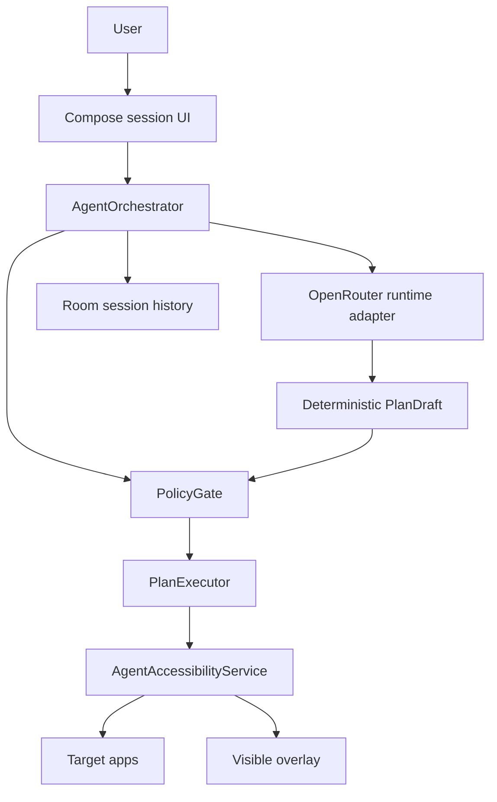

# Architecture

Mabi Agent is an Android-native supervised agent. It uses app UI for explicit user start, `AccessibilityService` for cross-app observation/action, deterministic DSL for all executable actions, policy gates for risk, and overlay/notification UI for visible active state.

## Runtime Rules

All agent planning runs through `OpenRouterLocalAgentRuntime`. The runtime still implements `LocalAgentRuntime` because the orchestrator depends on that interface, but the implementation is remote OpenRouter only.

No device-hosted model backend or fallback planner is allowed. Missing `OPENROUTER_API_KEY`, HTTP failures, rate limits, malformed OpenRouter responses, and validation failures stop the session and surface an error.

Runtime source sets must not use ADB client libraries, uiautomator2 runtime controllers, Appium runtime controllers, desktop RPC bridges, or shell command UI automation.

## Session Rules

- No action runs before explicit user start.
- Accessibility disabled or disconnected state fails closed before planning/execution.
- Planner output is accepted only after it becomes typed `AgentAction` steps.
- `confirm_user` is mandatory before send, pay, delete, post, share, install, upload, permission approval, or account/security changes.
- Korean high-risk goals are policy inputs, not UI copy only.
- Repeated screen/action loops are failures, not permission to keep tapping.

## Visibility Rules

Hidden background control is forbidden. A running session must maintain at least one visible active signal: accessibility overlay, target highlight, active badge, or foreground notification. If configured visible state cannot be shown, execution must stop safely.

## Verification Rules

Use `scripts/check_runtime_boundary.sh` to audit runtime source sets. Use emulator QA for each meaningful milestone. Use physical disconnected-device QA before any final standalone runtime claim.
