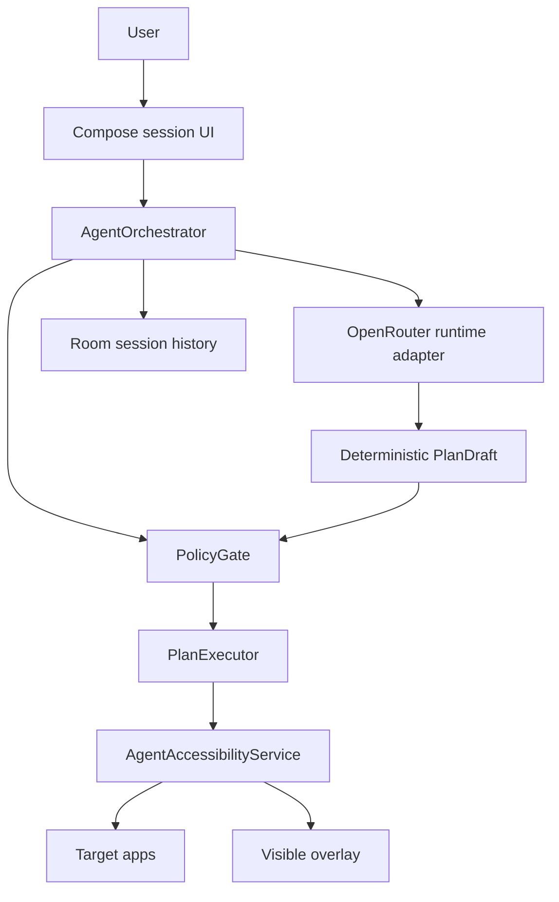

# OpenRouter Only Runtime Implementation Plan

> **For agentic workers:** REQUIRED SUB-SKILL: Use superpowers:subagent-driven-development (recommended) or superpowers:executing-plans to implement this plan task-by-task. Steps use checkbox (`- [ ]`) syntax for tracking.

**Goal:** Remove the local Gemma 4 E2B / LiteRT-LM / OpenCL runtime path and make every app agent session use OpenRouter only, stopping with a clear error when OpenRouter is unavailable.

**Architecture:** Keep `LocalAgentRuntime` as the app-facing interface so `AgentOrchestrator` and UI code do not need broad changes. Bind that interface only to `OpenRouterLocalAgentRuntime`; delete LiteRT-LM implementation code, tests, dependency declarations, and build flags. Add an OpenRouter-only audit script so LiteRT-LM/OpenCL code cannot re-enter runtime source.

**Tech Stack:** Kotlin, Android Gradle Plugin, Koin, Robolectric/JUnit, existing `runtime-litertlm` module containing the OpenRouter runtime class until a later module rename.

---

## File Structure

- Modify `app/src/main/java/com/guribbong/phoneappagent/di/AppModules.kt`
  - Responsibility: bind `LocalAgentRuntime` to `OpenRouterLocalAgentRuntime` unconditionally and show OpenRouter in UI settings defaults.
- Modify `app/build.gradle.kts`
  - Responsibility: expose OpenRouter config only; remove local model and remote-runtime switch `BuildConfig` fields.
- Create `app/src/test/kotlin/com/guribbong/phoneappagent/di/RuntimeSelectionTest.kt`
  - Responsibility: prove Koin resolves `LocalAgentRuntime` to `OpenRouterLocalAgentRuntime`.
- Delete `runtime-litertlm/src/main/kotlin/com/guribbong/phoneappagent/runtime/litertlm/LiteRtLmRuntime.kt`
  - Responsibility removed: local Gemma 4 E2B / LiteRT-LM / OpenCL runtime.
- Modify `runtime-litertlm/build.gradle.kts`
  - Responsibility: remove `libs.litertlm.android` and any local-runtime-only dependency.
- Modify `gradle/libs.versions.toml`
  - Responsibility: remove LiteRT-LM version/library aliases.
- Modify `runtime-litertlm/src/test/kotlin/com/guribbong/phoneappagent/runtime/litertlm/AppSkillPromptTest.kt`
  - Responsibility: keep OpenRouter prompt coverage and remove LiteRT prompt coverage.
- Delete `runtime-litertlm/src/test/kotlin/com/guribbong/phoneappagent/runtime/litertlm/LiteRtLmRuntimeMessagesPlanTest.kt`
  - Responsibility removed: local LiteRT planner normalization test.
- Create `runtime-litertlm/src/test/kotlin/com/guribbong/phoneappagent/runtime/litertlm/OpenRouterRuntimeFailureTest.kt`
  - Responsibility: prove missing OpenRouter key returns unsupported and prepare stops cleanly.
- Create `scripts/check_openrouter_only_runtime.sh`
  - Responsibility: fail if local LiteRT/Gemma/OpenCL runtime symbols remain in active code/config/docs.
- Modify `README.md`
  - Responsibility: document OpenRouter-only runtime and no local fallback.
- Modify `docs/architecture.md`
  - Responsibility: replace LiteRT-LM runtime architecture with OpenRouter-only runtime.
- Modify `docs/qa/physical-golden-scenarios-2026-05-01.md`
  - Responsibility: update recommended next fix from local fallback to OpenRouter-only runtime.
- Modify `docs/qa/adb-free-safety-hardening-report.md`
  - Responsibility: update runtime notes to OpenRouter-only behavior.

## Success Criteria

- `appModule` always binds `LocalAgentRuntime` to `OpenRouterLocalAgentRuntime`.
- `LiteRtLmLocalAgentRuntime`, `LiteRtLmRuntimeConfig`, `Backend.GPU`, `Backend.CPU`, `OpenCL`, and `libs.litertlm.android` are absent from active runtime code and active build files.
- `MABI_REMOTE_RUNTIME_ENABLED` and `MABI_LOCAL_MODEL_NAME` are removed.
- Missing OpenRouter API key produces `RuntimePreparation.ready == false` with `OPENROUTER_API_KEY is missing.` and no local fallback attempt.
- If OpenRouter request fails at runtime, the existing `OpenRouterLocalAgentRuntime` exception path propagates to `AgentOrchestrator.failSession(...)`, producing a failed session and no further actions.
- Unit tests, debug build, runtime boundary audit, and OpenRouter-only audit pass.

## Task 1: Prove Runtime DI Must Be OpenRouter Only

**Files:**
- Create: `app/src/test/kotlin/com/guribbong/phoneappagent/di/RuntimeSelectionTest.kt`
- Modify later: `app/src/main/java/com/guribbong/phoneappagent/di/AppModules.kt`

- [ ] **Step 1: Write the failing DI test**

Create `app/src/test/kotlin/com/guribbong/phoneappagent/di/RuntimeSelectionTest.kt`:

```kotlin
package com.guribbong.phoneappagent.di

import android.content.Context
import androidx.test.core.app.ApplicationProvider
import com.guribbong.phoneappagent.core.runner.LocalAgentRuntime
import com.guribbong.phoneappagent.runtime.litertlm.OpenRouterLocalAgentRuntime
import org.junit.After
import org.junit.Assert.assertTrue
import org.junit.Before
import org.junit.Test
import org.junit.runner.RunWith
import org.koin.android.ext.koin.androidContext
import org.koin.core.context.GlobalContext
import org.koin.core.context.startKoin
import org.koin.core.context.stopKoin
import org.robolectric.RobolectricTestRunner

@RunWith(RobolectricTestRunner::class)
class RuntimeSelectionTest {
    @Before
    fun resetKoinBefore() {
        stopKoin()
    }

    @After
    fun resetKoinAfter() {
        stopKoin()
    }

    @Test
    fun appModuleBindsEveryAgentSessionToOpenRouterRuntime() {
        startKoin {
            androidContext(ApplicationProvider.getApplicationContext<Context>())
            modules(appModule)
        }

        val runtime = GlobalContext.get().get<LocalAgentRuntime>()

        assertTrue(
            "LocalAgentRuntime must be OpenRouter-only; no LiteRT-LM fallback is allowed.",
            runtime is OpenRouterLocalAgentRuntime,
        )
    }
}
```

- [ ] **Step 2: Run test to verify it fails**

Run:

```bash
./gradlew --no-configuration-cache :app:testDebugUnitTest --tests 'com.guribbong.phoneappagent.di.RuntimeSelectionTest.appModuleBindsEveryAgentSessionToOpenRouterRuntime'
```

Expected: `FAILED` because current `appModule` binds `LiteRtLmLocalAgentRuntime` when `MABI_REMOTE_RUNTIME_ENABLED` is false.

- [ ] **Step 3: Change DI to always bind OpenRouter**

In `app/src/main/java/com/guribbong/phoneappagent/di/AppModules.kt`, remove these imports:

```kotlin
import com.guribbong.phoneappagent.runtime.litertlm.LiteRtLmLocalAgentRuntime
import com.guribbong.phoneappagent.runtime.litertlm.LiteRtLmRuntimeConfig
```

Replace `AgentSettings` defaults with:

```kotlin
data class AgentSettings(
    val modelName: String = BuildConfig.OPENROUTER_MODEL,
    val backend: String = "OpenRouter / ${BuildConfig.OPENROUTER_MODEL}",
    val overlayEnabled: Boolean = true,
)
```

Replace the `DefaultSettingsRepository.settings` mapping with:

```kotlin
override val settings: Flow<AgentSettings> =
    dataStore.data.map { prefs ->
        AgentSettings(
            modelName = prefs[modelKey] ?: BuildConfig.OPENROUTER_MODEL,
            backend = prefs[backendKey] ?: "OpenRouter / ${BuildConfig.OPENROUTER_MODEL}",
            overlayEnabled = prefs[overlayKey] ?: true,
        )
    }
```

Replace the `single<LocalAgentRuntime>` binding with:

```kotlin
single<LocalAgentRuntime> {
    OpenRouterLocalAgentRuntime(
        androidContext(),
        get(),
        OpenRouterRuntimeConfig(
            apiKey = BuildConfig.OPENROUTER_API_KEY,
            modelName = BuildConfig.OPENROUTER_MODEL,
            endpoint = BuildConfig.OPENROUTER_ENDPOINT,
            appReferer = BuildConfig.OPENROUTER_REFERER,
            appTitle = BuildConfig.OPENROUTER_TITLE,
        ),
    )
}
```

- [ ] **Step 4: Run DI test to verify it passes**

Run:

```bash
./gradlew --no-configuration-cache :app:testDebugUnitTest --tests 'com.guribbong.phoneappagent.di.RuntimeSelectionTest.appModuleBindsEveryAgentSessionToOpenRouterRuntime'
```

Expected: `BUILD SUCCESSFUL`.

- [ ] **Step 5: Commit**

```bash
git add app/src/test/kotlin/com/guribbong/phoneappagent/di/RuntimeSelectionTest.kt app/src/main/java/com/guribbong/phoneappagent/di/AppModules.kt
git commit -m "refactor: bind agent runtime to openrouter only"
```

## Task 2: Remove Runtime Build Flags For Local/Fallback Runtime

**Files:**
- Modify: `app/build.gradle.kts`

- [ ] **Step 1: Write a failing source assertion**

Run:

```bash
rg -n 'MABI_REMOTE_RUNTIME_ENABLED|MABI_LOCAL_MODEL_NAME|remoteRuntimeEnabled' app/build.gradle.kts app/src/main/java/com/guribbong/phoneappagent/di/AppModules.kt
```

Expected before implementation: matches exist for all three tokens.

- [ ] **Step 2: Remove local/fallback build fields**

In `app/build.gradle.kts`, delete:

```kotlin
val remoteRuntimeEnabled =
    dotEnv["MABI_REMOTE_RUNTIME_ENABLED"]?.toBooleanStrictOrNull()
        ?: System.getenv("MABI_REMOTE_RUNTIME_ENABLED")?.toBooleanStrictOrNull()
        ?: false
```

Also delete these `buildConfigField` lines:

```kotlin
buildConfigField("boolean", "MABI_REMOTE_RUNTIME_ENABLED", remoteRuntimeEnabled.toString())
buildConfigField("String", "MABI_LOCAL_MODEL_NAME", "\"Gemma 4 E2B\"")
```

Keep these OpenRouter fields:

```kotlin
buildConfigField("String", "OPENROUTER_API_KEY", "\"${escapeBuildConfig(openRouterApiKey)}\"")
buildConfigField("String", "OPENROUTER_MODEL", "\"${escapeBuildConfig(openRouterModel)}\"")
buildConfigField("String", "OPENROUTER_ENDPOINT", "\"${escapeBuildConfig(openRouterEndpoint)}\"")
buildConfigField("String", "OPENROUTER_REFERER", "\"${escapeBuildConfig(openRouterReferer)}\"")
buildConfigField("String", "OPENROUTER_TITLE", "\"${escapeBuildConfig(openRouterTitle)}\"")
```

- [ ] **Step 3: Run source assertion again**

Run:

```bash
rg -n 'MABI_REMOTE_RUNTIME_ENABLED|MABI_LOCAL_MODEL_NAME|remoteRuntimeEnabled' app/build.gradle.kts app/src/main/java/com/guribbong/phoneappagent/di/AppModules.kt
```

Expected: command exits with code `1` and prints no matches.

- [ ] **Step 4: Run app compile**

Run:

```bash
./gradlew --no-configuration-cache :app:compileDebugKotlin
```

Expected: `BUILD SUCCESSFUL`.

- [ ] **Step 5: Commit**

```bash
git add app/build.gradle.kts app/src/main/java/com/guribbong/phoneappagent/di/AppModules.kt
git commit -m "build: remove local runtime build switches"
```

## Task 3: Delete LiteRT-LM Runtime Code And Dependency

**Files:**
- Delete: `runtime-litertlm/src/main/kotlin/com/guribbong/phoneappagent/runtime/litertlm/LiteRtLmRuntime.kt`
- Delete: `runtime-litertlm/src/test/kotlin/com/guribbong/phoneappagent/runtime/litertlm/LiteRtLmRuntimeMessagesPlanTest.kt`
- Modify: `runtime-litertlm/build.gradle.kts`
- Modify: `gradle/libs.versions.toml`

- [ ] **Step 1: Run failing audit before deletion**

Run:

```bash
rg -n 'LiteRtLmLocalAgentRuntime|LiteRtLmRuntimeConfig|libs\\.litertlm\\.android|litertlm-android|OpenCL|Backend\\.GPU|Backend\\.CPU' runtime-litertlm gradle/libs.versions.toml
```

Expected before implementation: matches exist in `LiteRtLmRuntime.kt`, `LiteRtLmRuntimeMessagesPlanTest.kt`, `runtime-litertlm/build.gradle.kts`, and `gradle/libs.versions.toml`.

- [ ] **Step 2: Delete local runtime files**

Run:

```bash
rm runtime-litertlm/src/main/kotlin/com/guribbong/phoneappagent/runtime/litertlm/LiteRtLmRuntime.kt
rm runtime-litertlm/src/test/kotlin/com/guribbong/phoneappagent/runtime/litertlm/LiteRtLmRuntimeMessagesPlanTest.kt
```

- [ ] **Step 3: Remove LiteRT dependency aliases**

In `gradle/libs.versions.toml`, delete:

```toml
litertlm = "0.10.2"
```

Delete:

```toml
litertlm-android = { module = "com.google.ai.edge.litertlm:litertlm-android", version.ref = "litertlm" }
```

In `runtime-litertlm/build.gradle.kts`, delete:

```kotlin
implementation(libs.litertlm.android)
```

If `libs.gson` has no remaining use in `runtime-litertlm/src/main`, verify with:

```bash
rg -n 'gson|Gson' runtime-litertlm/src/main
```

If that command prints no matches, delete this line from `runtime-litertlm/build.gradle.kts`:

```kotlin
implementation(libs.gson)
```

- [ ] **Step 4: Run audit after deletion**

Run:

```bash
rg -n 'LiteRtLmLocalAgentRuntime|LiteRtLmRuntimeConfig|libs\\.litertlm\\.android|litertlm-android|OpenCL|Backend\\.GPU|Backend\\.CPU' runtime-litertlm/src/main runtime-litertlm/build.gradle.kts gradle/libs.versions.toml
```

Expected: command exits with code `1` and prints no matches.

- [ ] **Step 5: Run runtime module compile**

Run:

```bash
./gradlew --no-configuration-cache :runtime-litertlm:compileDebugKotlin
```

Expected: `BUILD SUCCESSFUL`.

- [ ] **Step 6: Commit**

```bash
git add runtime-litertlm/build.gradle.kts gradle/libs.versions.toml
git rm runtime-litertlm/src/main/kotlin/com/guribbong/phoneappagent/runtime/litertlm/LiteRtLmRuntime.kt
git rm runtime-litertlm/src/test/kotlin/com/guribbong/phoneappagent/runtime/litertlm/LiteRtLmRuntimeMessagesPlanTest.kt
git commit -m "refactor: delete local litert runtime"
```

## Task 4: Keep Prompt Tests OpenRouter Only

**Files:**
- Modify: `runtime-litertlm/src/test/kotlin/com/guribbong/phoneappagent/runtime/litertlm/AppSkillPromptTest.kt`

- [ ] **Step 1: Run test to show current LiteRT reference breaks after deletion**

Run:

```bash
./gradlew --no-configuration-cache :runtime-litertlm:testDebugUnitTest --tests 'com.guribbong.phoneappagent.runtime.litertlm.AppSkillPromptTest'
```

Expected after Task 3 and before this task: Kotlin compile fails because `LiteRtLmLocalAgentRuntime` no longer exists.

- [ ] **Step 2: Replace test file with OpenRouter-only coverage**

Replace `runtime-litertlm/src/test/kotlin/com/guribbong/phoneappagent/runtime/litertlm/AppSkillPromptTest.kt` with:

```kotlin
package com.guribbong.phoneappagent.runtime.litertlm

import android.content.Context
import android.content.ContextWrapper
import com.guribbong.phoneappagent.core.policy.PolicyGate
import com.guribbong.phoneappagent.core.runner.PlannerInput
import org.junit.Assert.assertFalse
import org.junit.Assert.assertTrue
import org.junit.Test

class AppSkillPromptTest {
    @Test
    fun openrouterPromptIncludesAppSkillGuidanceAndVisibleNodeSourceOfTruth() {
        val runtime = OpenRouterLocalAgentRuntime(
            context = object : ContextWrapper(null) {
                override fun getApplicationContext(): Context = this
            },
            policyGate = PolicyGate(),
            config = OpenRouterRuntimeConfig(
                apiKey = "test",
                modelName = "google/gemma-4-26b-a4b-it",
                endpoint = "https://openrouter.ai/api/v1/chat/completions",
                appReferer = "https://example.com",
                appTitle = "Phone App Agent Tests",
            ),
        )
        val method = OpenRouterLocalAgentRuntime::class.java.getDeclaredMethod("buildPrompt", PlannerInput::class.java)
        method.isAccessible = true
        val prompt = method.invoke(runtime, settingsPlannerInput()) as String

        assertTrue(prompt.contains("appSkillGuidance"))
        assertTrue(prompt.contains("search_settings"))
        assertTrue(prompt.contains("visibleNodes"))
        assertFalse(prompt.contains("LiteRT"))
        assertFalse(prompt.contains("OpenCL"))
    }

    private fun settingsPlannerInput(): PlannerInput =
        PlannerInput(
            goal = "Open Settings and search for wifi.",
            foregroundPackage = "com.android.settings",
            lastExternalForegroundPackage = "com.android.settings",
            serializedNodeTree = "text=Search settings | desc=Search settings | id= | class=android.widget.TextView | package=com.android.settings | editable=false | clickable=true",
            recentActionHistory = emptyList(),
            appMemory = emptyList(),
            appSkillGuidance = listOf("app=Settings package=com.android.settings\nprocedure=search_settings"),
            riskHints = emptyList(),
        )
}
```

- [ ] **Step 3: Run prompt test**

Run:

```bash
./gradlew --no-configuration-cache :runtime-litertlm:testDebugUnitTest --tests 'com.guribbong.phoneappagent.runtime.litertlm.AppSkillPromptTest'
```

Expected: `BUILD SUCCESSFUL`.

- [ ] **Step 4: Commit**

```bash
git add runtime-litertlm/src/test/kotlin/com/guribbong/phoneappagent/runtime/litertlm/AppSkillPromptTest.kt
git commit -m "test: keep prompt coverage openrouter only"
```

## Task 5: Add OpenRouter Fail-Fast Runtime Tests

**Files:**
- Create: `runtime-litertlm/src/test/kotlin/com/guribbong/phoneappagent/runtime/litertlm/OpenRouterRuntimeFailureTest.kt`

- [ ] **Step 1: Write fail-fast tests**

Create `runtime-litertlm/src/test/kotlin/com/guribbong/phoneappagent/runtime/litertlm/OpenRouterRuntimeFailureTest.kt`:

```kotlin
package com.guribbong.phoneappagent.runtime.litertlm

import android.content.Context
import android.content.ContextWrapper
import com.guribbong.phoneappagent.core.policy.PolicyGate
import kotlinx.coroutines.runBlocking
import org.junit.Assert.assertEquals
import org.junit.Assert.assertFalse
import org.junit.Test

class OpenRouterRuntimeFailureTest {
    @Test
    fun missingApiKeyMarksRuntimeUnsupportedWithoutLocalFallback() = runBlocking {
        val runtime = OpenRouterLocalAgentRuntime(
            context = object : ContextWrapper(null) {
                override fun getApplicationContext(): Context = this
            },
            policyGate = PolicyGate(),
            config = OpenRouterRuntimeConfig(
                apiKey = "",
                modelName = "google/gemma-4-26b-a4b-it",
                endpoint = "https://openrouter.ai/api/v1/chat/completions",
                appReferer = "https://example.com",
                appTitle = "Phone App Agent Tests",
            ),
        )

        val profile = runtime.probeDeviceCapability()
        val preparation = runtime.prepare(profile)

        assertFalse(profile.supported)
        assertEquals("OPENROUTER_API_KEY is missing.", profile.reason)
        assertFalse(preparation.ready)
        assertEquals("OPENROUTER_API_KEY is missing.", preparation.detail)
    }
}
```

- [ ] **Step 2: Run test**

Run:

```bash
./gradlew --no-configuration-cache :runtime-litertlm:testDebugUnitTest --tests 'com.guribbong.phoneappagent.runtime.litertlm.OpenRouterRuntimeFailureTest'
```

Expected: `BUILD SUCCESSFUL`.

- [ ] **Step 3: Commit**

```bash
git add runtime-litertlm/src/test/kotlin/com/guribbong/phoneappagent/runtime/litertlm/OpenRouterRuntimeFailureTest.kt
git commit -m "test: verify openrouter fail fast path"
```

## Task 6: Add OpenRouter-Only Audit Script

**Files:**
- Create: `scripts/check_openrouter_only_runtime.sh`

- [ ] **Step 1: Create audit script**

Create `scripts/check_openrouter_only_runtime.sh`:

```bash
#!/usr/bin/env bash
set -euo pipefail

ROOT_DIR="${1:-$(pwd)}"
cd "$ROOT_DIR"

SCAN_PATHS=(
  "app/build.gradle.kts"
  "app/src/main"
  "runtime-litertlm/build.gradle.kts"
  "runtime-litertlm/src/main"
  "gradle/libs.versions.toml"
  "README.md"
  "docs/architecture.md"
  "docs/qa/adb-free-safety-hardening-report.md"
  "docs/qa/physical-golden-scenarios-2026-05-01.md"
)

FORBIDDEN='LiteRtLm|LiteRT-LM|litertlm|litertlm-android|MABI_REMOTE_RUNTIME_ENABLED|MABI_LOCAL_MODEL_NAME|OpenCL|Backend\\.GPU|Backend\\.CPU|local Gemma|local runtime'

echo "[openrouter-only] scanning active runtime code, build files, and current docs"

if rg -n --pcre2 "$FORBIDDEN" "${SCAN_PATHS[@]}"; then
  echo
  echo "[openrouter-only] FAILED: local LiteRT/Gemma/OpenCL runtime references remain."
  echo "Every agent session must use OpenRouter; delete local runtime code instead of keeping fallback paths."
  exit 1
fi

echo "[openrouter-only] OK: active runtime path is OpenRouter-only."
```

- [ ] **Step 2: Make script executable**

Run:

```bash
chmod +x scripts/check_openrouter_only_runtime.sh
```

- [ ] **Step 3: Run script and confirm it fails before docs are updated**

Run:

```bash
bash scripts/check_openrouter_only_runtime.sh
```

Expected before Task 7: `FAILED` because current docs still mention LiteRT-LM/local runtime.

- [ ] **Step 4: Commit script**

```bash
git add scripts/check_openrouter_only_runtime.sh
git commit -m "test: add openrouter-only runtime audit"
```

## Task 7: Update Active Runtime Docs And QA Reports

**Files:**
- Modify: `README.md`
- Modify: `docs/architecture.md`
- Modify: `docs/qa/adb-free-safety-hardening-report.md`
- Modify: `docs/qa/physical-golden-scenarios-2026-05-01.md`

- [ ] **Step 1: Update README runtime section**

In `README.md`, replace the current default runtime section with:

```markdown
## Runtime Direction

Product runtime is OpenRouter only. `OPENROUTER_API_KEY` must be configured before an agent session can plan actions.

There is no local Gemma, device model, GPU, CPU, OpenCL, or fallback runtime path in the shipped app. If OpenRouter is unavailable, the session fails with a visible error and no accessibility action is executed.
```

If `README.md` has verification commands, add:

```bash
bash scripts/check_openrouter_only_runtime.sh
```

- [ ] **Step 2: Update architecture runtime diagram and rules**

In `docs/architecture.md`, replace runtime references with:

```markdown
## Runtime Rules

All agent planning runs through `OpenRouterLocalAgentRuntime`. The runtime still implements `LocalAgentRuntime` because the orchestrator depends on that interface, but the implementation is remote OpenRouter only.

No local model runtime, GPU backend, CPU backend, OpenCL backend, or fallback runtime is allowed. Missing `OPENROUTER_API_KEY`, HTTP failures, rate limits, malformed OpenRouter responses, and validation failures stop the session and surface an error.
```

In the Mermaid diagram, use:



- [ ] **Step 3: Update QA reports**

In `docs/qa/physical-golden-scenarios-2026-05-01.md`, replace the "Recommended Next Fix" section with:

```markdown
## Recommended Next Fix

Remove the local runtime path and run every agent through OpenRouter:

- Bind `LocalAgentRuntime` to `OpenRouterLocalAgentRuntime` only.
- Delete device model runtime code and dependencies.
- Stop sessions with a clear error when `OPENROUTER_API_KEY` is missing or OpenRouter fails.
- Re-run G01 Settings Wi-Fi and G08 Messages confirm after OpenRouter-only runtime is installed.
```

In `docs/qa/adb-free-safety-hardening-report.md`, add this note under `## Notes`:

```markdown
Runtime direction changed after physical QA: agent planning must use OpenRouter only. Local device model and OpenCL failures are no longer accepted runtime paths.
```

- [ ] **Step 4: Run docs audit**

Run:

```bash
bash scripts/check_openrouter_only_runtime.sh
```

Expected: `OK: active runtime path is OpenRouter-only.`

- [ ] **Step 5: Commit**

```bash
git add README.md docs/architecture.md docs/qa/adb-free-safety-hardening-report.md docs/qa/physical-golden-scenarios-2026-05-01.md
git commit -m "docs: document openrouter-only agent runtime"
```

## Task 8: Full Verification

**Files:**
- No new files.
- Uses all files changed in Tasks 1-7.

- [ ] **Step 1: Run capacity check**

Run:

```bash
scripts/check_capacity.sh /Users/guribbong/code/phone_app_agent
```

Expected: command completes. If host free space is below 10 GiB, stop and clean old build/QA artifacts before running Gradle.

- [ ] **Step 2: Run unit tests**

Run:

```bash
./gradlew --no-configuration-cache :app:testDebugUnitTest :runtime-litertlm:testDebugUnitTest :core-policy:test :core-runner:test
```

Expected: `BUILD SUCCESSFUL`.

- [ ] **Step 3: Run audits**

Run:

```bash
bash scripts/check_runtime_boundary.sh
bash scripts/check_openrouter_only_runtime.sh
```

Expected:

```text
[runtime-boundary] OK: no forbidden desktop/ADB automation terms in runtime source sets.
[openrouter-only] OK: active runtime path is OpenRouter-only.
```

- [ ] **Step 4: Build APK**

Run:

```bash
./gradlew --no-configuration-cache :app:assembleDebug
```

Expected: `BUILD SUCCESSFUL` and APK at `app/build/outputs/apk/debug/app-debug.apk`.

- [ ] **Step 5: Physical smoke with OpenRouter configured**

Run only after `OPENROUTER_API_KEY` exists in `.env` or environment:

```bash
QA_DEVICE_SERIAL=R39M204WQ5K \
QA_ENABLE_ACCESSIBILITY=1 \
QA_SEED_PROMPT='Open Settings and show the Wi-Fi page without changing anything.' \
QA_AUTO_QUEUE=1 \
QA_WAIT_FOR_SESSION_TERMINAL=1 \
QA_SESSION_TIMEOUT_SEC=180 \
QA_POST_LAUNCH_WAIT_SEC=5 \
scripts/qa_milestone.sh physical-openrouter-g01-settings-wifi app/build/outputs/apk/debug/app-debug.apk
```

Expected:

- If OpenRouter works: session status is `completed` or a later app-specific execution failure with `action_logs_latest.txt` containing plan/action evidence.
- If OpenRouter fails: session status is `failed`, `failureReason` contains the OpenRouter error, and `action_logs_latest.txt` contains no unsafe commit action.
- The old failure `This device cannot run Gemma 4 E2B on GPU because OpenCL is unavailable.` must not appear.

- [ ] **Step 6: Commit final verification note**

If smoke artifacts are generated, update `docs/qa/physical-golden-scenarios-2026-05-01.md` with:

```markdown
## OpenRouter-Only Recheck

- Scenario: G01 Settings Wi-Fi
- Artifact: `qa_artifacts/physical-openrouter-g01-settings-wifi/`
- Result: [copy exact `status`, `currentStepIndex`, and `failureReason` from `chat_session_latest.txt`]
- OpenCL local-runtime failure observed: no
```

Then commit:

```bash
git add docs/qa/physical-golden-scenarios-2026-05-01.md qa_artifacts/physical-openrouter-g01-settings-wifi
git commit -m "qa: record openrouter-only physical smoke"
```

## Self-Review

Spec coverage:

- "Do not use Gemma 4 E2B / LiteRT-LM CPU / OpenCL local model": Tasks 2, 3, 6, and 7 remove build flags, code, dependency, audit residues, and docs.
- "Delete relevant code": Task 3 deletes `LiteRtLmRuntime.kt` and `LiteRtLmRuntimeMessagesPlanTest.kt`; Task 4 removes remaining LiteRT prompt test.
- "All agents through OpenRouter": Task 1 forces DI to OpenRouter; Task 5 verifies OpenRouter failure behavior.
- "No fallback": Task 1 removes DI branch; Task 2 removes runtime switch; Task 6 audit rejects fallback/local-runtime tokens.
- "If OpenRouter has a problem, output error and stop operation": Task 5 tests missing API key unsupported state; Task 8 physical smoke requires OpenRouter error to become failed session with no unsafe action.

Placeholder scan:

- No `TBD`, `TODO`, `implement later`, "similar to", or unfilled code snippets remain in this plan.

Type consistency:

- `OpenRouterLocalAgentRuntime`, `OpenRouterRuntimeConfig`, `LocalAgentRuntime`, `PolicyGate`, and `appModule` names match current source.
- `RuntimeSelectionTest` uses existing Koin and Robolectric test dependencies already available in `app/build.gradle.kts`.

